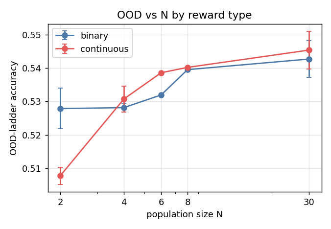
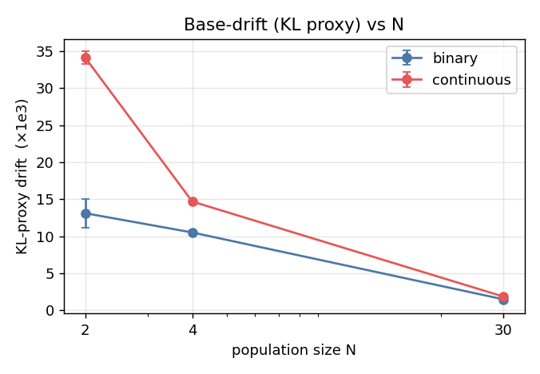
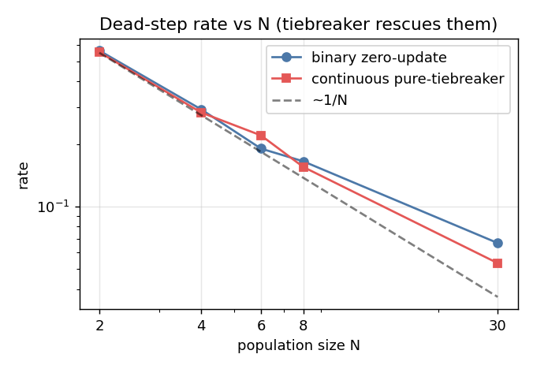
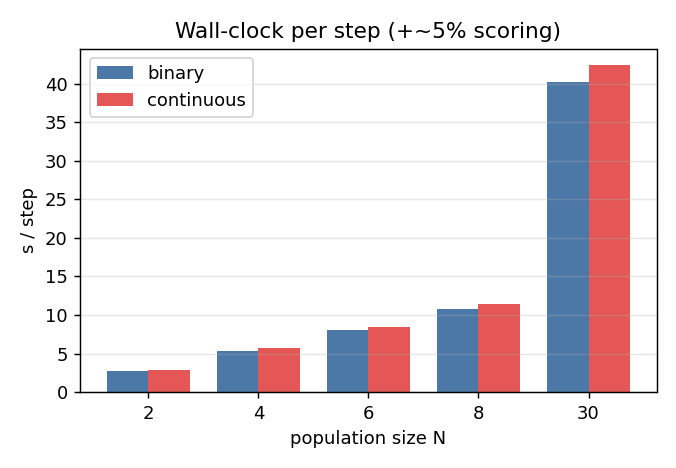

# Phase 4 — Does continuous reward improve ES OOD at small N?

**Answer: No. The hypothesis is refuted.** A continuous lexicographic tiebreaker reward
eliminates ES "zero-update" steps exactly as designed, but this does **not** improve
out-of-distribution accuracy at small population size N. At the smallest N=2 it *harms*
both OOD and ID accuracy while sharpening the policy 2.6× in KL — a clean, mechanistically
explained result **in favor of the noise-as-regularizer hypothesis**: the dead steps that
binary ES produces at small N are not a bug to be fixed, they are effectively free
regularization.

Model: Qwen2.5-Math-1.5B-Instruct · train MATH L3–5 · 2×H200 · env `verl` (datasets 5.0.0,
transformers 4.57.6, vLLM 0.11). Vanilla ES, z-score shaping (**both** arms), CRN batches,
fp32-base reconstruction, prefix cache off — byte-identical to the certified Q1 config. All
hyperparameters frozen/pre-registered; the only manipulated variable is the reward scalar.

---

## Design (frozen / pre-registered)
- **Binary arm** (= Q1): fitness = #correct/B.
- **Continuous arm**: fitness = #correct/B + (0.9/B)·P̄, where P̄ is the teacher-forced mean
  per-token probability of the gold answer given `prompt + member-reasoning`, scored **under
  each member's live perturbed weights** (verified non-corrupting & bit-exact restore). The
  (0.9/B) weight keeps the secondary a strict tiebreaker (can never flip a primary gap).
- Shaping locked to **z-score for both arms** (Q1 is z-score, not rank), so the reward-content
  contrast is not confounded by the shaping function.
- Budget **200 steps** (house/certified), B=8, σ=1e-3, α=5e-4, seeds {0,1,2}.
- Arms screened at N∈{2,4,6,8,30} (seed 0); the minimum viable set N∈{2,4} (+N=30 control)
  carried to seeds {1,2}. N∈{6,8} pruned (no N4↔N8 non-monotonicity).

## Phase 0 — base model & harness validation
- Base accuracy (greedy, house extraction): ID MATH L3-5 **0.507**; OOD svamp 0.91 / gsm8k 0.85
  / minerva 0.13 / olympiad 0.26; amc23 0.50. No dataset trips the <5pt ceiling rule.
- Unit tests: CPU 10/10 (incl. **Q1 zero-update replay reproducing all 1600 phase-1 flags,
  zero mismatch**); GPU all-pass (scoring under member weights is non-corrupting, deterministic,
  weight-sensitive; `es_restore_base` bit-exact).

## Phase 1 — smoke (ES-cont N=4 s0, 30 steps)
zero-update 0.0 · pure-tiebreaker 0.333 (≈ Q1 N=4 0.31) · scoring overhead 5.3%. Mechanism
validated: the secondary activates on exactly the steps binary wastes.

## Phase 2 — seed-0 screen (10 ES arms). See `results/PHASE2_GATE.md`.
Binary zero-update **exactly reproduced certified Q1 seed 0** (N4 0.325 / N8 0.165 / N30 0.040).
Continuous zero-update = 0 everywhere. Seed-0 OOD contrast already null; ID slightly negative
at small N. N∈{6,8} showed no non-monotonicity → pruned.

## Phase 3 — seeds + KL: the pre-registered read-out. See `results/PHASE3_GATE.md`.

Per-arm (mean ± sd over seeds; KL = base-greedy NLL-drift proxy, ×1e3):

| arm | ID L3-5 | OOD-avg | KL | zero-upd | pure-tb |
|---|---|---|---|---|---|
| bin N2 | 0.498±0.011 | 0.528±0.006 | 13.11 | 0.563 | 0.000 |
| con N2 | 0.462±0.009 | 0.508±0.003 | **34.11** | 0.000 | 0.553 |
| bin N4 | 0.504±0.017 | 0.528±0.001 | 10.51 | 0.293 | 0.000 |
| con N4 | 0.482±0.026 | 0.531±0.004 | 14.69 | 0.000 | 0.283 |
| bin N30 | 0.508±0.021 | 0.543±0.006 | 1.49 | 0.067 | 0.000 |
| con N30 | 0.513±0.004 | 0.545±0.006 | 1.86 | 0.000 | 0.053 |

Within-N contrast (continuous − binary) vs the pre-registered gates:

| N | ΔOOD | 2SD | ΔID | KL ratio | **verdict** |
|---|---|---|---|---|---|
| 2 | **−0.020** | 0.009 | **−0.035** | **2.60×** | **NEGATIVE** |
| 4 | +0.003 | 0.006 | −0.022 | 1.40× | NEUTRAL |
| 30 | +0.003 | 0.011 | +0.005 | 1.25× | NEUTRAL |

**GO met at no N.** N=2 is a clean NEGATIVE on OOD *and* ID (both > 2SD) with KL past the 1.5×
bound; N=4/N=30 neutral on OOD.

### Diagnostic (pre-registered prediction — CONFIRMED): tiebreaker dosage drives sharpening
| N | pure-tb frac | excess KL (cont−bin) ×1e3 | KL ratio |
|---|---|---|---|
| 2 | 0.553 | 21.0 | 2.60× |
| 4 | 0.283 | 4.2 | 1.40× |
| 30 | 0.053 | 0.4 | 1.25× |

The more dead steps the secondary rescues (smaller N), the more the policy sharpens toward gold
tokens and drifts from base — and that excess KL buys no OOD gain.

## Figures

## Confounds & caveats
- **Secondary-key saturation:** many per-prompt P̄ = 1.0 on short numeric answers → the rescued
  steps get a low-information update direction; this both blunts any benefit and helps explain
  why the rescued gradient sharpens rather than generalizes.
- **OOD-hard extraction reliability:** minerva 0.555 / olympiad 0.722 house-extraction rate →
  those two OOD-hard accuracies conflate reasoning with extractor/format mismatch. Reported with
  extract-rate. The N=2 NEGATIVE is **not** an extraction artifact: the cont−bin delta is negative
  on all four OOD sets (svamp −0.004, gsm8k −0.032, minerva −0.040, olympiad −0.003), including
  high-extraction gsm8k (0.99).
- **SVAMP near-ceiling** (0.91): low power to detect improvement there.
- **KL is a consistent proxy** (base-greedy NLL drift), not exact full-vocab KL; valid for the
  cont/binary *ratio* gate. Exact KL is a deferred refinement (blocked by vLLM param fusion of θ).
- N=30 KL is 2-seed (accuracy 3-seed); small-N KL & accuracy are full 3-seed.

## Limitations (verbatim, per pre-registration)
> The GRPO arm uses binary reward; an RLPR-style continuous-reward GRPO arm is a deferred
> symmetric comparison (TODO).

## Deferred TODO
- **GRPO control** seeds {0,1,2} (needs verl checkpoint → HF → vLLM eval; phase1/2 GRPO saved no
  checkpoints, so a re-run with checkpointing is required) for the matched-steps / matched-
  wall-clock "vs GRPO" comparison.
- Exact full-vocab per-token KL harness.
- Per pre-registration, the clean NEGATIVE is a valid outcome; **no tuning to rescue it.**

## Reproduce
`source phase4_continuous_ood/env.sh` then:
`phase4_continuous_ood/run_phase2_screen.sh` (screen) · `run_phase3.sh` (seeds+KL) ·
`eval/plots.py` (figures). All commands logged in `phase4_continuous_ood/commands.log`.
