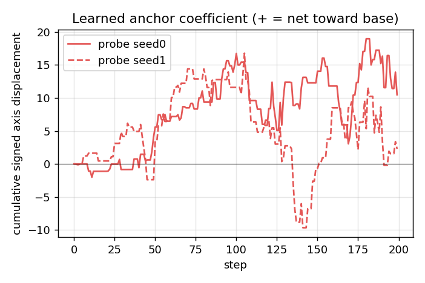
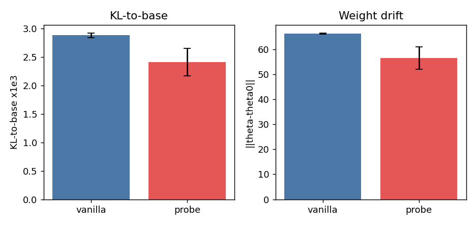

# Base-axis probe — pilot report (N=16, seeds {0,1}, 200 steps, a_max=1.0)

**Result: the mechanism does NOT decline to regularize — it modestly and consistently pulls
toward base, cutting KL-to-base and weight drift at no accuracy cost. But it does not improve
OOD (the actual goal), the effect is small, and this is a 2-seed pilot in a low-drift regime.**
A weakly-positive, underpowered signal — promising enough to confirm, not to conclude.

## Arm summary (mean over seeds {0,1})
| variant | ID L3-5 | OOD-avg | KL ×1e3 | weight drift | cum_disp | scale-flagged |
|---|---|---|---|---|---|---|
| **base-axis probe** | 0.495 | 0.541 | **2.41** | **56.5** | **+6.39** | 5% |
| vanilla control | 0.479 | 0.543 | 2.88 | 66.3 | 0.00 | n/a |

## GO-gate check (pre-registered: probe KL < vanilla at matched ID, OOD not worse)
- **ID accuracy:** probe 0.495 vs vanilla 0.479 → **+0.016** (matched, slightly better).
- **KL-to-base:** probe 2.41 vs vanilla 2.88 → **−16%**, and **lower in BOTH seeds** (s0 2.17<2.84, s1 2.65<2.92).
- **OOD-avg:** probe 0.541 vs vanilla 0.543 → −0.002 (not worse).
→ The GO gate is **directionally met, consistently across 2/2 seeds** — but see caveats.

## Headline diagnostic — learned anchor coefficient (cum_disp)
The net signed displacement along the base axis went **positive** in both seeds (+10.5 s0, +2.3 s1):
ES, given the option, chose to move **toward** base. This is the opposite of the pre-registered
"declines to regularize" negative outcome. Trajectory: flat until drift accumulates (~step 40),
then climbs positive.

## Train-reward directional derivative (honest regime check)
Over 796 anchor pairs (both seeds): toward-base-helps 141, hurts 122, **tie 533 (67%)**; mean
(f₊−f₋) = **+0.004**. So on fresh train batches, moving toward base is roughly *neutral* (very
slightly helpful), NOT clearly harmful — consistent with the noise-as-regularizer view that the
ES drift isn't buying much even on train reward. The large tie fraction shows the signal is sparse.

## Caveats (why this is a signal, not a conclusion)
1. **2 seeds** — direction is consistent (2/2) but no formal significance.
2. **Effect is on KL/drift, not OOD.** OOD is flat; the original hypothesis (OOD improvement) is
   NOT supported — the probe buys *lower drift at equal OOD*, i.e. free regularization, not a gain.
3. **Low-drift regime.** At N=16 the vanilla KL is only ~2.9e-3 (vs 34e-3 at N=2 in Phase 4), so
   there's little drift to prune — the effect is small in absolute terms and may matter more where
   drift is large.
4. **Confound:** the probe spends 4/16 members on anchors → 12 Gaussian vs vanilla's 16, so fewer
   explorers could partly explain lower drift. `cum_disp` isolates the *direct* anchor contribution
   (+6.4, clearly positive), but a matched **N=12 vanilla control** would cleanly separate the two.

## Suggested next steps
- Add seeds (2→5) for significance.
- **N=12 vanilla control** to kill the fewer-explorers confound.
- Test in a **high-drift regime** where regularization should matter: small N (2–4), more steps, or
  the Phase-4 continuous-reward setting (which had 2.6× KL blow-up at N=2) — the probe might prune
  that meaningfully.
- LoRA reparametrization (the originally-planned follow-up phase).
